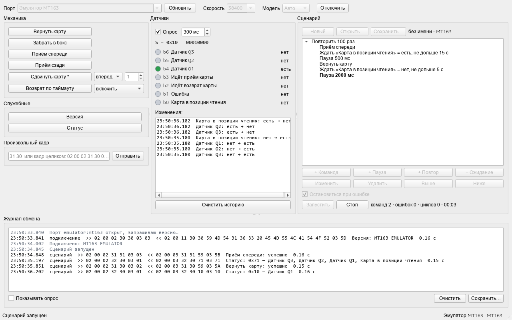

# Mingte Tech Service Tool

Программа для наладки и проверки картоприёмников и диспенсеров Mingte по COM-порту. Поддерживаются MT163 и MT166.



- механические команды вручную;
- датчики в реальном времени и история их изменений;
- сценарии из команд, пауз, ожидания датчика и вложенных циклов, со счётчиками команд, ошибок и циклов — для прогонов на стенде;
- отправка произвольного кадра;
- журнал обмена в hex с расшифровкой, сохранение в файл;
- эмуляторы обеих моделей для работы без устройства.

Программа неофициальная, к Shenzhen Mingte Tech отношения не имеет. Протокол описан в [docs/protocol.md](docs/protocol.md).

## Запуск

Нужен Python 3.11 или новее.

```
python -m venv .venv
.venv\Scripts\activate
pip install -e .[dev]
python -m mtservice
```

Готовый exe собирается командой `.\build.ps1`; результат — `dist\MingteTechServiceTool.exe`.

## Подключение

Выберите порт и скорость: у MT163 по умолчанию 38400, у MT166 — 9600. В режиме «Авто» модель определяется по ответу на запрос версии. Если выбрать модель вручную, скорость подставится сама.

Сразу после подключения запускается опрос статуса — по умолчанию раз в 300 мс. Опрос можно выключить или поменять интервал на панели датчиков.

«Приём спереди» и «Приём сзади» ждут, пока карту вставят, поэтому ответ может прийти секунд через десять.

## Сценарии

Сценарий — это дерево шагов:

- команда с параметрами;
- пауза;
- повтор N раз или без конца — внутри него другие шаги;
- ожидание, пока датчик примет нужное состояние, с ограничением по времени.

Если включено «Остановиться при ошибке», сценарий прерывается на первом отказе устройства или истёкшем ожидании. Иначе ошибка учитывается в счётчике, а выполнение продолжается. Опрос датчиков во время сценария не прекращается.

Сценарии хранятся в JSON. Примеры — в папке [examples](examples).

## Тесты

```
pytest
```

Тесты интерфейса работают без экрана (`QT_QPA_PLATFORM=offscreen`) и общаются с эмулятором.
